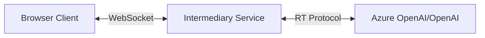

# Azure OpenAI Realtime API Integration Samples

This repository contains sample implementations demonstrating how to build backend and frontend services that interact with Azure OpenAI Realtime APIs. 

> Based on [aoai-realtime-audio-sdk/samples](https://github.com/Azure-Samples/aoai-realtime-audio-sdk/tree/main/samples/middle-tier)

## Overview

When building applications that leverage Azure OpenAI or OpenAI's Realtime APIs, it's often beneficial to introduce an intermediary service layer. This architecture:

- Simplifies client-side implementation
- Provides a consistent interface regardless of the backend provider
- Allows for better security and credential management
- Enables easier protocol extensions and customizations

## Repository Structure

```
azure-realtime-audio/
├── backend/                # Node.js backend implementation
├── frontend/               # React fronend implementation
├── infra/                  # Bicep template for Azure deployment

```

## Available Samples

### Backend Implementations

#### Node.js Express Server (`node-express/`)
- Built with Express.js and WebSocket
- Demonstrates Node.js-based implementation
- Uses Pino for logging
- Supports both Azure OpenAI and OpenAI backends

### Frontend Implementation

#### React Frontend (`frontend/`)
- React-based implementation
- Compatible with all backend implementations
- Demonstrates audio handling and streaming responses
- Provides a reference UI implementation

## Communication Protocol

All implementations use a shared, simplified WebSocket-based protocol for client-server communication:

### Client to Server Messages

```typescript
// Text message from user
{
    "type": "user_message",
    "id": string,
    "text": string
}

// Binary audio data
Binary WebSocket frames containing raw PCM audio data
```

### Server to Client Messages

```typescript
// Text streaming
{
    "type": "text_delta",
    "id": string,
    "delta": string
}

// Speech recognition results
{
    "type": "transcription",
    "id": string,
    "text": string
}

// Control messages
{
    "type": "control",
    "action": "connected" | "speech_started" | "text_done",
    "greeting"?: string,
    "id"?: string
}

// Binary audio data
Binary WebSocket frames containing raw PCM audio data
```

## Getting Started

1. Choose and set up a backend implementation:
   - Follow the README in `backend/` for Node.js setup

2. Set up the frontend:
   - Follow the README in `frontend/` for frontend setup
   - Configure the WebSocket endpoint to point to your chosen backend

3. Configure environment variables:
   - Set up Azure OpenAI or OpenAI credentials
   - Configure backend-specific settings

## Common Environment Variables

All backend implementations share these common variables:

```env
# Backend Selection
BACKEND=azure|openai

# Azure OpenAI Configuration
AZURE_OPENAI_ENDPOINT=your-endpoint
AZURE_OPENAI_DEPLOYMENT=your-deployment

# [or] OpenAI Configuration
OPENAI_API_KEY=your-api-key
OPENAI_MODEL=your-model

# Server Configuration
PORT=8080
```

## Architecture Overview



## Development

Each sample includes its own development setup and tools:

- Backend (Node.js): Uses ESLint and Prettier
- Frontend (React): Uses ESLint and Prettier

## Contributing

Feel free to contribute additional implementations or improvements:

1. Backend implementations in other languages/frameworks
2. Alternative frontend implementations
3. Protocol extensions
4. Documentation improvements

## Notes

- These samples are intended for demonstration purposes
- Adjust security settings and implement proper authentication for production use
- The protocol can be extended to support additional features
- Consider implementing error handling and recovery mechanisms for production
